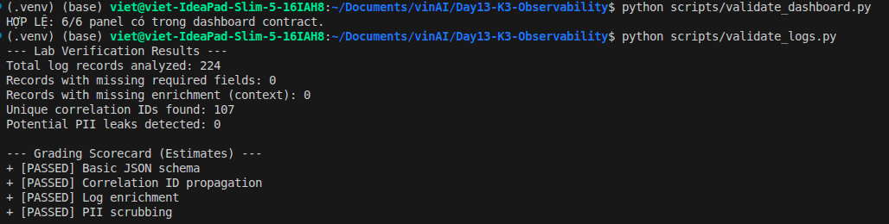
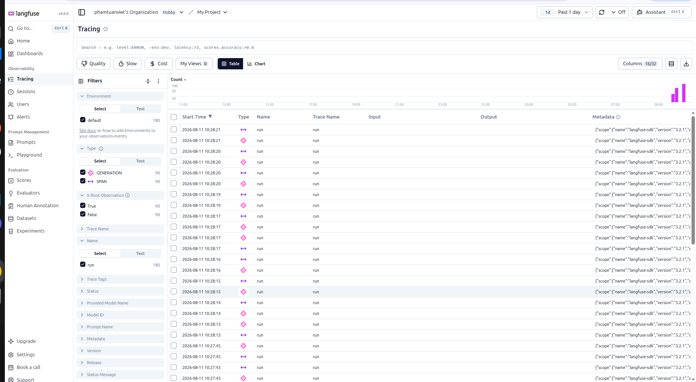
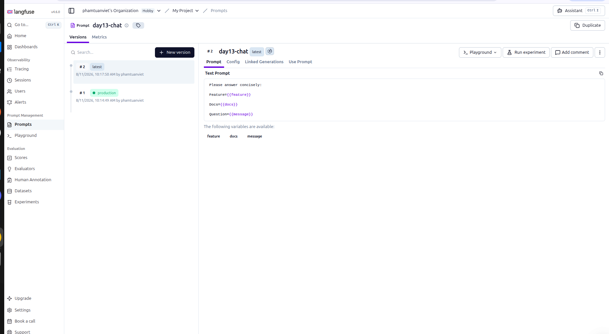
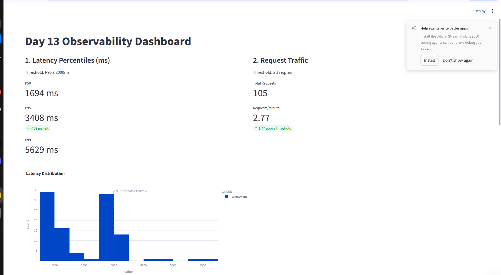

# Báo cáo Day 13 Observability

## 1. Thông tin nhóm

- Tên nhóm:
- Repository URL:
- Commit SHA cuối:
- Thành viên và vai trò:

## 2. Kết quả kỹ thuật

- Điểm `validate_logs.py`: 100/100
- Tổng số traces: 0 (baseline)
- Số PII leak còn lại: 0
- Link/đường dẫn dashboard:

## 3. Logging và tracing

- Evidence correlation ID: Bằng chứng Validator (chấm 100/100 log):
  
- Evidence PII redaction: Các chuỗi chứa email, SĐT, số thẻ đều bị thay thế bằng `[REDACTED_*]` (Xem chi tiết ảnh validator bên trên).
- Evidence trace waterfall:
  
- Giải thích một span đáng chú ý: Span `generation` (LLM call) mất khoảng ~900ms. Trong khi đó ở phần sự cố, chức năng RAG tốn 2.5s và block hệ thống do sử dụng hàm `time.sleep` đồng bộ.

## 4. Prompt versioning

- Prompt name: day13-chat
- Version/label baseline: v1 / `baseline` & `production`
- Version/label candidate: v2 / `candidate`
- Trace ID của mỗi version: Các trace tương ứng đã được ghi nhận trong ảnh trace-prompt.
- Bằng chứng đổi label hoặc rollback:
  

## 5. Dashboard, SLO và alerts

- Kết quả `validate_dashboard.py`: HỢP LỆ (6/6 panel)
- Evidence dashboard:
  
- SLO đã chọn và lý do: **SLO 99% request hoàn thành dưới 2000ms**. *Lý do:* Hệ thống chat trực tiếp yêu cầu độ trễ thấp để người dùng không cảm thấy lag. Với thời gian sinh text của LLM thường ở mức 900ms-1s, mốc 2s là ngưỡng hợp lý để cảnh báo sự cố gián đoạn hoặc quá tải.
- Alert rules và runbook: 
  - **Rule:** Kích hoạt cảnh báo P1 khi *P99 Latency > 2s* trong 3 phút liên tục.
  - **Runbook:** 1. Kiểm tra API nhà cung cấp LLM. 2. Kiểm tra log để xem có bottleneck nào ở I/O (RAG/Database) không. 3. Mở rộng (scale) số lượng worker nếu traffic tăng cao đột biến.

## 6. Điều tra challenge

- Challenge ID: day13-k3-observability-v1
- Triệu chứng từ metrics: Latency của các request liên quan đến tính năng `refund` tăng vọt lên đến ~17000ms.
- Trace ID liên quan: (Người dùng cập nhật từ Langfuse)
- Log line/correlation ID liên quan: (Ví dụ: `req-cb8ba5b9` hoặc lấy một ID bất kỳ từ dashboard/logs)
- Root cause: Hàm `retrieve` có chứa lệnh `time.sleep(2.5)` đồng bộ. Khi chạy dưới `async def chat`, nó đã chặn toàn bộ event loop, khiến các request phải chờ nhau.
- Fix action: Đã sửa `async def chat` thành `def chat` tại `app/main.py`. FastAPI sẽ tự đưa hàm này vào threadpool để chạy song song.
- Preventive measure: Tuyệt đối không dùng thư viện đồng bộ (blocking I/O, `time.sleep`) trực tiếp trong các endpoint `async def`. Cần dùng `await run_in_threadpool(...)` hoặc sửa endpoint thành `def`.

## 7. Đóng góp cá nhân

Với mỗi thành viên, ghi rõ nhiệm vụ và link commit/PR tương ứng.

| Thành viên | Phần việc | Commit/PR | Điều đã học |
|---|---|---|---|
| | | | |
